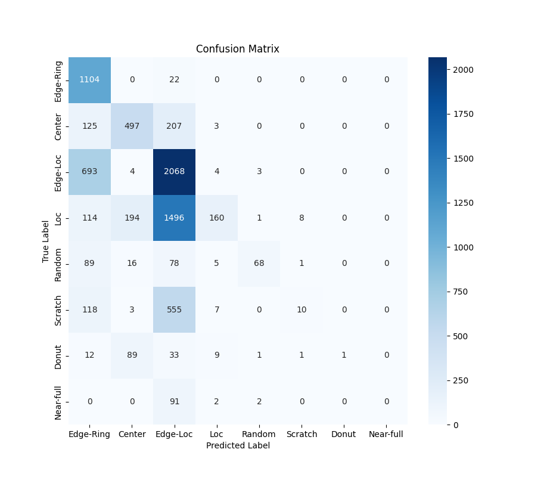

# Model A1
## Experiment 1
| Epoch | Loss   | Accuracy |
|-------|--------|----------|
| 1     | 1.0572 | 0.6546   |
| 2     | 0.7643 | 0.7090   |
| 3     | 0.6602 | 0.7470   |
| 4     | 0.5568 | 0.7922   |
| 5     | 0.4841 | 0.8196   |
| 6     | 0.4266 | 0.8405   |
| 7     | 0.4002 | 0.8506   |
| 8     | 0.3672 | 0.8644   |
| 9     | 0.3296 | 0.8779   |
| 10    | 0.3042 | 0.8907   |

**Per class accuracy report**
|    class     |precision |   recall|  f1-score  | support|
|--------------|----------|---------|------------|--------|
|  Edge-Ring   |   0.84   |  0.88   |  0.86      | 1126   |
|     Center   |   0.62   |  0.83   |  0.71      |  832   |
|   Edge-Loc   |   0.64   |  0.87   |  0.74      | 2772   |
|        Loc   |   0.56   |  0.43   |  0.49      | 1973   |
|     Random   |   0.66   |  0.71   |  0.68      |  257   |
|    Scratch   |   0.48   |  0.04   |  0.07      |  693   |
|      Donut   |   0.67   |  0.01   |  0.03      |  146   |
|  Near-full   |   0.00   |  0.00   |  0.00      |   95   |
|              |          |         |            |        |    
|    accuracy  |          |         |   0.65     | 7894   |
|   macro avg  |    0.56  |   0.47  |   0.45     | 7894   |
|weighted avg  |    0.63  |   0.65  |   0.61     | 7894   |

**Confusion Matrix**

## Experiment 2
| Epoch | Loss   | Accuracy |
|-------|--------|----------|
| 1     | 1.0526 | 0.6690   |
| 2     | 0.7641 | 0.7162   |
| 3     | 0.6358 | 0.7652   |
| 4     | 0.5332 | 0.8096   |
| 5     | 0.4438 | 0.8344   |
| 6     | 0.3967 | 0.8511   |
| 7     | 0.3562 | 0.8727   |
| 8     | 0.3182 | 0.8835   |
| 9     | 0.2938 | 0.8947   |
| 10    | 0.2548 | 0.9073   | 
| 11    | 0.2364 | 0.9139   |
| 12    | 0.2146 | 0.9233   |
| 13    | 0.1945 | 0.9300   |
| 14    | 0.1857 | 0.9348   |
| 15    | 0.1622 | 0.9438   |
| 16    | 0.1620 | 0.9443   |
| 17    | 0.1383 | 0.9521   |
| 18    | 0.1274 | 0.9581   |
| 19    | 0.1208 | 0.9581   |
| 20    | 0.1184 | 0.9636   | 

**Per class accuracy report**
|             | precision  | recall | f1-score | support |
|-------------|------------|--------|----------|---------| 
|   Edge-Ring |      0.49  |   0.98 |     0.65 |    1126 |
|      Center |      0.62  |   0.60 |     0.61 |     832 |
|    Edge-Loc |      0.45  |   0.75 |     0.56 |    2772 |
|         Loc |      0.84  |   0.08 |     0.15 |    1973 |
|      Random |      0.91  |   0.26 |     0.41 |     257 |
|     Scratch |      0.50  |   0.01 |     0.03 |     693 |
|       Donut |      1.00  |   0.01 |     0.01 |     146 |
|   Near-full |      0.00  |   0.00 |     0.00 |      95 |
|             |            |        |          |         | 
|    accuracy |            |        |     0.50 |    7894 |
|   macro avg |      0.60  |   0.34 |     0.30 |    7894 |
|weighted avg |      0.60  |   0.50 |     0.41 |    7894 |

**Confusion Matrix**
