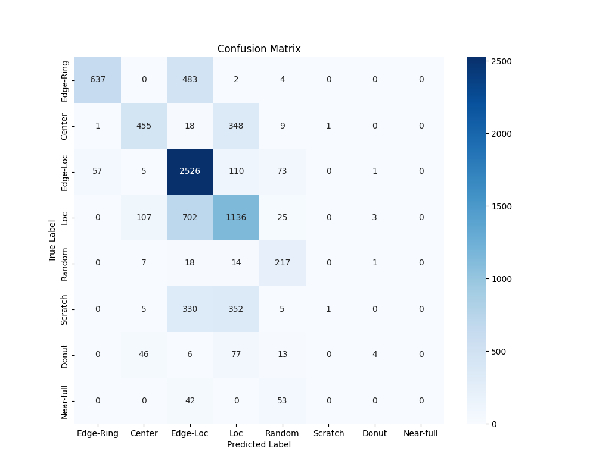

- [Model A1](#model-a1)
  - [Experiment 1](#experiment-1)
  - [Experiment 2](#experiment-2)
  - [Experiment 3](#experiment-3)
  - [Experiment 4](#experiment-4)
  - [Experiment 5](#experiment-5)
  - [Experiment 6](#experiment-6)
  - [Experiment 7](#experiment-7)
  - [Experiment 8](#experiment-8)
  - [Experiment 9](#experiment-9)
# Model A1

## Experiment 1
| Epoch | Loss   | Accuracy |
|-------|--------|----------|
| 1     | 1.0572 | 0.6546   |
| 2     | 0.7643 | 0.7090   |
| 3     | 0.6602 | 0.7470   |
| 4     | 0.5568 | 0.7922   |
| 5     | 0.4841 | 0.8196   |
| 6     | 0.4266 | 0.8405   |
| 7     | 0.4002 | 0.8506   |
| 8     | 0.3672 | 0.8644   |
| 9     | 0.3296 | 0.8779   |
| 10    | 0.3042 | 0.8907   |

**Per class accuracy report**
|    class     |precision |   recall|  f1-score  | support|
|--------------|----------|---------|------------|--------|
|  Edge-Ring   |   0.84   |  0.88   |  0.86      | 1126   |
|     Center   |   0.62   |  0.83   |  0.71      |  832   |
|   Edge-Loc   |   0.64   |  0.87   |  0.74      | 2772   |
|        Loc   |   0.56   |  0.43   |  0.49      | 1973   |
|     Random   |   0.66   |  0.71   |  0.68      |  257   |
|    Scratch   |   0.48   |  0.04   |  0.07      |  693   |
|      Donut   |   0.67   |  0.01   |  0.03      |  146   |
|  Near-full   |   0.00   |  0.00   |  0.00      |   95   |
|              |          |         |            |        |    
|    accuracy  |          |         |   0.65     | 7894   |
|   macro avg  |    0.56  |   0.47  |   0.45     | 7894   |
|weighted avg  |    0.63  |   0.65  |   0.61     | 7894   |

**Confusion Matrix**

## Experiment 2
| Epoch | Loss   | Accuracy |
|-------|--------|----------|
| 1     | 1.0526 | 0.6690   |
| 2     | 0.7641 | 0.7162   |
| 3     | 0.6358 | 0.7652   |
| 4     | 0.5332 | 0.8096   |
| 5     | 0.4438 | 0.8344   |
| 6     | 0.3967 | 0.8511   |
| 7     | 0.3562 | 0.8727   |
| 8     | 0.3182 | 0.8835   |
| 9     | 0.2938 | 0.8947   |
| 10    | 0.2548 | 0.9073   | 
| 11    | 0.2364 | 0.9139   |
| 12    | 0.2146 | 0.9233   |
| 13    | 0.1945 | 0.9300   |
| 14    | 0.1857 | 0.9348   |
| 15    | 0.1622 | 0.9438   |
| 16    | 0.1620 | 0.9443   |
| 17    | 0.1383 | 0.9521   |
| 18    | 0.1274 | 0.9581   |
| 19    | 0.1208 | 0.9581   |
| 20    | 0.1184 | 0.9636   | 

**Per class accuracy report**
|             | precision  | recall | f1-score | support |
|-------------|------------|--------|----------|---------| 
|   Edge-Ring |      0.49  |   0.98 |     0.65 |    1126 |
|      Center |      0.62  |   0.60 |     0.61 |     832 |
|    Edge-Loc |      0.45  |   0.75 |     0.56 |    2772 |
|         Loc |      0.84  |   0.08 |     0.15 |    1973 |
|      Random |      0.91  |   0.26 |     0.41 |     257 |
|     Scratch |      0.50  |   0.01 |     0.03 |     693 |
|       Donut |      1.00  |   0.01 |     0.01 |     146 |
|   Near-full |      0.00  |   0.00 |     0.00 |      95 |
|             |            |        |          |         | 
|    accuracy |            |        |     0.50 |    7894 |
|   macro avg |      0.60  |   0.34 |     0.30 |    7894 |
|weighted avg |      0.60  |   0.50 |     0.41 |    7894 |

**Confusion Matrix**

## Experiment 3
| Epoch | Loss   | Accuracy |
|-------|--------|----------|
| 1     | 1.0533 | 0.6489   |
| 2     | 0.8380 | 0.6933   |
| 3     | 0.7045 | 0.7476   |
| 4     | 0.5846 | 0.7803   |
| 5     | 0.5220 | 0.8083   |
| 6     | 0.4674 | 0.8212   |
| 7     | 0.4315 | 0.8368   |
| 8     | 0.3910 | 0.8522   |
| 9     | 0.3494 | 0.8692   |
| 10    | 0.3160 | 0.8817   |

**Per class accuracy report**
|             | precision  | recall | f1-score | support |
|-------------|------------|--------|----------|---------|
|   Edge-Ring |      0.92  |   0.57 |     0.70 |    1126 |
|      Center |      0.73  |   0.55 |     0.62 |     832 |
|    Edge-Loc |      0.61  |   0.91 |     0.73 |    2772 |
|         Loc |      0.56  |   0.58 |     0.57 |    1973 |
|      Random |      0.54  |   0.84 |     0.66 |     257 |
|     Scratch |      0.50  |   0.00 |     0.00 |     693 |
|       Donut |      0.44  |   0.03 |     0.05 |     146 |
|   Near-full |      1.00  |   0.00 |     0.00 |      95 |
|             |            |        |          |         |
|    accuracy |            |        |     0.63 |    7894 |
|   macro avg |      0.66  |   0.43 |     0.42 |    7894 |
|weighted avg |      0.64  |   0.63 |     0.59 |    7894 |

**Confusion Matrix**

## Experiment 4
| Epoch | Loss   | Accuracy |
|-------|--------|----------|
| 1     | 1.0139 | 0.6635   |
| 2     | 0.7721 | 0.7072   |
| 3     | 0.7094 | 0.7310   |
| 4     | 0.6433 | 0.7601   |
| 5     | 0.5376 | 0.7960   |
| 6     | 0.4798 | 0.8174   |
| 7     | 0.4126 | 0.8437   |
| 8     | 0.3652 | 0.8622   |
| 9     | 0.3357 | 0.8751   |
| 10    | 0.2979 | 0.8923   |

**Per class accuracy report**
| Category    | Precision | Recall | F1-Score | Support |
|------------|-----------|--------|----------|---------|
| Edge-Ring  | 0.69      | 0.93   | 0.79     | 1126    |
| Center     | 0.65      | 0.63   | 0.64     | 832     |
| Edge-Loc   | 0.64      | 0.76   | 0.69     | 2772    |
| Loc        | 0.57      | 0.39   | 0.47     | 1973    |
| Random     | 0.53      | 0.85   | 0.65     | 257     |
| Scratch    | 0.36      | 0.23   | 0.28     | 693     |
| Donut      | 0.31      | 0.12   | 0.18     | 146     |
| Near-full  | 1.00      | 0.00   | 0.00     | 95      |
|           |          |        |         |         |
| Accuracy  |         |        | 0.61     | 7894    |
| Macro Avg | 0.59    | 0.49   | 0.46     | 7894    |
| Weighted Avg | 0.60 | 0.61   | 0.59     | 7894    |

**Confusion Matrix**

## Experiment 5
| Epoch | Loss   | Accuracy |
|-------|--------|----------|
| 1     | 1.0304 | 0.6585   |
| 2     | 0.7473 | 0.7160   |
| 3     | 0.5957 | 0.7786   |
| 4     | 0.4960 | 0.8146   |
| 5     | 0.4447 | 0.8322   |
| 6     | 0.3597 | 0.8631   |
| 7     | 0.3211 | 0.8764   |
| 8     | 0.3009 | 0.8877   |
| 9     | 0.2599 | 0.8993   |
| 10    | 0.2425 | 0.9089   |

**Per class accuracy report**
| Category    | Precision | Recall | F1-Score | Support |
|------------|-----------|--------|----------|---------|
| Edge-Ring  | 0.79      | 0.89   | 0.84     | 1126    |
| Center     | 0.68      | 0.71   | 0.70     | 832     |
| Edge-Loc   | 0.64      | 0.85   | 0.73     | 2772    |
| Loc        | 0.64      | 0.46   | 0.53     | 1973    |
| Random     | 0.57      | 0.81   | 0.67     | 257     |
| Scratch    | 0.43      | 0.16   | 0.23     | 693     |
| Donut      | 0.67      | 0.18   | 0.28     | 146     |
| Near-full  | 1.00      | 0.00   | 0.00     | 95      |
|           |          |        |         |         |
| Accuracy  |         |        | 0.66     | 7894    |
| Macro Avg | 0.68    | 0.51   | 0.50     | 7894    |
| Weighted Avg | 0.65 | 0.66   | 0.63     | 7894    |

**Confusion Matrix**

## Experiment 6
| Epoch | Loss   | Accuracy |
|-------|--------|----------|
| 1     | 1.0304 | 0.6585   |
| 2     | 0.7473 | 0.7160   |
| 3     | 0.5957 | 0.7786   |
| 4     | 0.4960 | 0.8146   |
| 5     | 0.4447 | 0.8322   |
| 6     | 0.3597 | 0.8631   |
| 7     | 0.3211 | 0.8764   |
| 8     | 0.3009 | 0.8877   |
| 9     | 0.2599 | 0.8993   |
| 10    | 0.2425 | 0.9089   |

**Per class accuracy report**
| Category    | Precision | Recall | F1-Score | Support |
|------------|-----------|--------|----------|---------|
| Edge-Ring  | 0.79      | 0.89   | 0.84     | 1126    |
| Center     | 0.68      | 0.71   | 0.70     | 832     |
| Edge-Loc   | 0.64      | 0.85   | 0.73     | 2772    |
| Loc        | 0.64      | 0.46   | 0.53     | 1973    |
| Random     | 0.57      | 0.81   | 0.67     | 257     |
| Scratch    | 0.43      | 0.16   | 0.23     | 693     |
| Donut      | 0.67      | 0.18   | 0.28     | 146     |
| Near-full  | 1.00      | 0.00   | 0.00     | 95      |
|           |          |        |         |         |
| Accuracy  |         |        | 0.66     | 7894    |
| Macro Avg | 0.68    | 0.51   | 0.50     | 7894    |
| Weighted Avg | 0.65 | 0.66   | 0.63     | 7894    |

**Confusion Matrix**

## Experiment 7
| Epoch | Loss   | Accuracy |
|-------|--------|----------|
| 1     | 1.0586 | 0.6536   |
| 2     | 0.8174 | 0.7012   |
| 3     | 0.7248 | 0.7361   |
| 4     | 0.6271 | 0.7664   |
| 5     | 0.5692 | 0.7870   |
| 6     | 0.4952 | 0.8106   |
| 7     | 0.4435 | 0.8346   |
| 8     | 0.4189 | 0.8423   |
| 9     | 0.3987 | 0.8492   |
| 10    | 0.3643 | 0.8592   |
| 11    | 0.3191 | 0.8829   |
| 12    | 0.2895 | 0.8893   |
| 13    | 0.2670 | 0.8970   |
| 14    | 0.2445 | 0.9097   |
| 15    | 0.2250 | 0.9169   |
| 16    | 0.2001 | 0.9258   |
| 17    | 0.1786 | 0.9340   |
| 18    | 0.1750 | 0.9349   |
| 19    | 0.1579 | 0.9420   |
| 20    | 0.1616 | 0.9436   |

**Per class accuracy report**
| Category    | Precision | Recall | F1-Score | Support |
|------------|-----------|--------|----------|---------|
| Edge-Ring  | 0.88      | 0.77   | 0.82     | 1126    |
| Center     | 0.76      | 0.68   | 0.72     | 832     |
| Edge-Loc   | 0.72      | 0.83   | 0.77     | 2772    |
| Loc        | 0.59      | 0.67   | 0.63     | 1973    |
| Random     | 0.71      | 0.73   | 0.72     | 257     |
| Scratch    | 0.39      | 0.23   | 0.29     | 693     |
| Donut      | 0.53      | 0.16   | 0.25     | 146     |
| Near-full  | 1.00      | 0.00   | 0.00     | 95      |
|           |          |        |         |         |
| Accuracy  |         |        | 0.69     | 7894    |
| Macro Avg | 0.70    | 0.51   | 0.52     | 7894    |
| Weighted Avg | 0.68 | 0.69   | 0.67     | 7894    |

**Confusion Matrix**

## Experiment 8
| Epoch | Loss   | Accuracy |
|-------|--------|----------|
| 1     | 1.1036 | 0.6298   |
| 2     | 0.8351 | 0.6913   |
| 3     | 0.7574 | 0.7191   |
| 4     | 0.6695 | 0.7480   |
| 5     | 0.5757 | 0.7808   |
| 6     | 0.4514 | 0.8288   |
| 7     | 0.3941 | 0.8525   |
| 8     | 0.3402 | 0.8725   |
| 9     | 0.3015 | 0.8907   |
| 10    | 0.2802 | 0.8988   |
| 11    | 0.2306 | 0.9176   |
| 12    | 0.2003 | 0.9276   |
| 13    | 0.1945 | 0.9279   |
| 14    | 0.1759 | 0.9384   |
| 15    | 0.1627 | 0.9438   |
| 16    | 0.1380 | 0.9510   |
| 17    | 0.1227 | 0.9578   |
| 18    | 0.1132 | 0.9611   |
| 19    | 0.1101 | 0.9626   |
| 20    | 0.1017 | 0.9648   |
| 21    | 0.0860 | 0.9693   |
| 22    | 0.0796 | 0.9729   |
| 23    | 0.0780 | 0.9742   |
| 24    | 0.0724 | 0.9759   |
| 25    | 0.0699 | 0.9774   |
| 26    | 0.0622 | 0.9790   |
| 27    | 0.0575 | 0.9805   |
| 28    | 0.0551 | 0.9814   |
| 29    | 0.0534 | 0.9821   |
| 30    | 0.0532 | 0.9821   |

**Per class accuracy report**
| Category    | Precision | Recall | F1-Score | Support |
|------------|-----------|--------|----------|---------|
| Edge-Ring  | 0.86      | 0.85   | 0.85     | 1126    |
| Center     | 0.72      | 0.76   | 0.74     | 832     |
| Edge-Loc   | 0.81      | 0.76   | 0.78     | 2772    |
| Loc        | 0.69      | 0.56   | 0.62     | 1973    |
| Random     | 0.76      | 0.76   | 0.76     | 257     |
| Scratch    | 0.29      | 0.54   | 0.37     | 693     |
| Donut      | 0.51      | 0.25   | 0.33     | 146     |
| Near-full  | 0.88      | 0.81   | 0.84     | 95      |
|           |          |        |         |         |
| Accuracy  |         |        | 0.69     | 7894    |
| Macro Avg | 0.69    | 0.66   | 0.66     | 7894    |
| Weighted Avg | 0.73 | 0.69   | 0.70     | 7894    |

**Confusion Matrix**

## Experiment 9
| Epoch | Loss   | Accuracy |
|-------|--------|----------|
| 1     | 1.0628 | 0.6460   |
| 2     | 0.8219 | 0.6929   |
| 3     | 0.7539 | 0.7163   |
| 4     | 0.6856 | 0.7378   |
| 5     | 0.5652 | 0.7868   |
| 6     | 0.4645 | 0.8244   |
| 7     | 0.4051 | 0.8406   |
| 8     | 0.3688 | 0.8566   |
| 9     | 0.3351 | 0.8738   |
| 10    | 0.2938 | 0.8955   |
| 11    | 0.2493 | 0.9089   |
| 12    | 0.2253 | 0.9209   |
| 13    | 0.2131 | 0.9259   |
| 14    | 0.1898 | 0.9341   |
| 15    | 0.1726 | 0.9405   |
| 16    | 0.1499 | 0.9480   |
| 17    | 0.1305 | 0.9555   |
| 18    | 0.1269 | 0.9567   |
| 19    | 0.1134 | 0.9611   |
| 20    | 0.1120 | 0.9614   |
| 21    | 0.0959 | 0.9666   |
| 22    | 0.0892 | 0.9695   |
| 23    | 0.0820 | 0.9720   |
| 24    | 0.0797 | 0.9726   |
| 25    | 0.0801 | 0.9729   |
| 26    | 0.0687 | 0.9766   |
| 27    | 0.0691 | 0.9767   |
| 28    | 0.0641 | 0.9767   |
| 29    | 0.0622 | 0.9783   |
| 30    | 0.0605 | 0.9786   |
| 31    | 0.0591 | 0.9800   |
| 32    | 0.0540 | 0.9814   |
| 33    | 0.0541 | 0.9813   |
| 34    | 0.0540 | 0.9809   |
| 35    | 0.0548 | 0.9804   |
| 36    | 0.0497 | 0.9825   |
| 37    | 0.0483 | 0.9831   |
| 38    | 0.0487 | 0.9838   |
| 39    | 0.0481 | 0.9843   |
| 40    | 0.0494 | 0.9833   |

**Per class accuracy report**
| Category    | Precision | Recall | F1-Score | Support |
|------------|-----------|--------|----------|---------|
| Edge-Ring  | 0.90      | 0.75   | 0.82     | 1126    |
| Center     | 0.77      | 0.77   | 0.77     | 832     |
| Edge-Loc   | 0.78      | 0.79   | 0.79     | 2772    |
| Loc        | 0.68      | 0.55   | 0.61     | 1973    |
| Random     | 0.73      | 0.79   | 0.76     | 257     |
| Scratch    | 0.28      | 0.53   | 0.37     | 693     |
| Donut      | 0.54      | 0.34   | 0.42     | 146     |
| Near-full  | 0.86      | 0.62   | 0.72     | 95      |
|           |          |        |         |         |
| Accuracy  |         |        | 0.69     | 7894    |
|Macro Avg | 0.69    | 0.64   | 0.65     | 7894    |
| Weighted Avg | 0.72 | 0.69   | 0.70     | 7894    |

**Confusion Matrix**

## Experiment 10
| Epoch | Loss   | Accuracy |
|-------|--------|----------|
| 1     | 1.4109 | 0.5421   |
| 2     | 1.1612 | 0.5812   |
| 3     | 1.1112 | 0.5908   |
| 4     | 1.0951 | 0.5947   |
| 5     | 1.0812 | 0.5989   |
| 6     | 1.0683 | 0.6016   |
| 7     | 1.0619 | 0.5995   |
| 8     | 1.0433 | 0.6061   |
| 9     | 1.0322 | 0.6096   |
| 10    | 1.0226 | 0.6134   |
| 11    | 1.0277 | 0.6121   |
| 12    | 1.0060 | 0.6182   |
| 13    | 0.9996 | 0.6201   |
| 14    | 0.9836 | 0.6282   |
| 15    | 0.9651 | 0.6308   |
| 16    | 0.9520 | 0.6356   |
| 17    | 0.9423 | 0.6387   |
| 18    | 0.9339 | 0.6463   |
| 19    | 0.9233 | 0.6488   |
| 20    | 0.9159 | 0.6472   |
| 21    | 0.9117 | 0.6526   |
| 22    | 0.9064 | 0.6521   |
| 23    | 0.8979 | 0.6546   |
| 24    | 0.8788 | 0.6660   |
| 25    | 0.8881 | 0.6619   |
| 26    | 0.8654 | 0.6679   |
| 27    | 0.8600 | 0.6713   |
| 28    | 0.8489 | 0.6727   |
| 29    | 0.8495 | 0.6730   |
| 30    | 0.8419 | 0.6774   |
| 31    | 0.8426 | 0.6758   |
| 32    | 0.8261 | 0.6856   |
| 33    | 0.8289 | 0.6769   |
| 34    | 0.8256 | 0.6826   |
| 35    | 0.8259 | 0.6815   |
| 36    | 0.8236 | 0.6855   |
| 37    | 0.8176 | 0.6853   |
| 38    | 0.8128 | 0.6836   |
| 39    | 0.8004 | 0.6915   |
| 40    | 0.8008 | 0.6925   |
| 41    | 0.8105 | 0.6861   |
| 42    | 0.7965 | 0.6942   |
| 43    | 0.7968 | 0.6930   |
| 44    | 0.7953 | 0.6946   |
| 45    | 0.8018 | 0.6959   |
| 46    | 0.7964 | 0.6967   |
| 47    | 0.7937 | 0.6916   |
| 48    | 0.7887 | 0.6953   |
| 49    | 0.7881 | 0.6955   |
| 50    | 0.7847 | 0.6965   |
| 51    | 0.7702 | 0.7033   |
| 52    | 0.7652 | 0.7037   |
| 53    | 0.7590 | 0.7054   |
| 54    | 0.7611 | 0.7069   |
| 55    | 0.7561 | 0.7074   |
| 56    | 0.7587 | 0.7079   |
| 57    | 0.7580 | 0.7069   |
| 58    | 0.7609 | 0.7045   |
| 59    | 0.7540 | 0.7105   |
| 60    | 0.7574 | 0.7048   |
| 61    | 0.7534 | 0.7101   |
| 62    | 0.7517 | 0.7079   |
| 63    | 0.7459 | 0.7092   |
| 64    | 0.7469 | 0.7103   |
| 65    | 0.7482 | 0.7109   |
| 66    | 0.7466 | 0.7092   |
| 67    | 0.7437 | 0.7142   |
| 68    | 0.7384 | 0.7149   |
| 69    | 0.7428 | 0.7126   |
| 70    | 0.7481 | 0.7124   |
| 71    | 0.7419 | 0.7121   |
| 72    | 0.7431 | 0.7143   |
| 73    | 0.7447 | 0.7090   |
| 74    | 0.7350 | 0.7157   |
| 75    | 0.7372 | 0.7135   |

**Per class accuracy report**
| Category    | Precision | Recall | F1-Score | Support |
|------------|-----------|--------|----------|---------|
| Edge-Ring  | 0.90      | 0.65   | 0.75     | 1126    |
| Center     | 0.52      | 0.63   | 0.57     | 832     |
| Edge-Loc   | 0.62      | 0.89   | 0.73     | 2772    |
| Loc        | 0.57      | 0.51   | 0.54     | 1973    |
| Random     | 0.84      | 0.63   | 0.72     | 257     |
| Scratch    | 0.58      | 0.08   | 0.13     | 693     |
| Donut      | 0.36      | 0.10   | 0.16     | 146     |
| Near-full  | 1.00      | 0.05   | 0.10     | 95      |
|           |          |        |         |         |
| Accuracy  |         |        | 0.63     | 7894    |
| Macro Avg | 0.67    | 0.44   | 0.46     | 7894    |
| Weighted Avg | 0.64 | 0.63   | 0.60     | 7894    |

**Confusion Matrix**

## Experiment 11
| Epoch | Loss   | Accuracy |
|-------|--------|----------|
| 1     | 0.9992 | 0.5342   |
| 2     | 0.7926 | 0.5771   |
| 3     | 0.7665 | 0.5872   |
| 4     | 0.7510 | 0.5887   |
| 5     | 0.7335 | 0.5959   |
| 6     | 0.7275 | 0.5983   |
| 7     | 0.7088 | 0.6042   |
| 8     | 0.7109 | 0.5969   |
| 9     | 0.6983 | 0.6019   |
| 10    | 0.6939 | 0.6056   |
| 11    | 0.6897 | 0.6083   |
| 12    | 0.6908 | 0.6090   |
| 13    | 0.6799 | 0.6167   |
| 14    | 0.6728 | 0.6162   |
| 15    | 0.6640 | 0.6184   |
| 16    | 0.6578 | 0.6188   |
| 17    | 0.6487 | 0.6235   |
| 18    | 0.6418 | 0.6280   |
| 19    | 0.6266 | 0.6339   |
| 20    | 0.6101 | 0.6410   |
| 21    | 0.6145 | 0.6356   |
| 22    | 0.5984 | 0.6448   |
| 23    | 0.5923 | 0.6446   |
| 24    | 0.5835 | 0.6495   |
| 25    | 0.5656 | 0.6538   |
| 26    | 0.5709 | 0.6550   |
| 27    | 0.5549 | 0.6622   |
| 28    | 0.5557 | 0.6668   |
| 29    | 0.5511 | 0.6657   |
| 30    | 0.5416 | 0.6714   |
| 31    | 0.5356 | 0.6697   |
| 32    | 0.5399 | 0.6713   |
| 33    | 0.5256 | 0.6764   |
| 34    | 0.5200 | 0.6790   |
| 35    | 0.5249 | 0.6742   |
| 36    | 0.5114 | 0.6854   |
| 37    | 0.5014 | 0.6862   |
| 38    | 0.5071 | 0.6845   |
| 39    | 0.5084 | 0.6795   |
| 40    | 0.4991 | 0.6869   |
| 41    | 0.4970 | 0.6902   |
| 42    | 0.4956 | 0.6878   |
| 43    | 0.4932 | 0.6928   |
| 44    | 0.4967 | 0.6916   |
| 45    | 0.4852 | 0.6959   |
| 46    | 0.4880 | 0.6954   |
| 47    | 0.4867 | 0.6934   |
| 48    | 0.4881 | 0.6927   |
| 49    | 0.4822 | 0.6928   |
| 50    | 0.4825 | 0.6965   |
| 51    | 0.4702 | 0.7008   |
| 52    | 0.4771 | 0.7012   |
| 53    | 0.4756 | 0.6988   |
| 54    | 0.4749 | 0.6988   |
| 55    | 0.4803 | 0.6979   |
| 56    | 0.4668 | 0.7078   |
| 57    | 0.4779 | 0.6997   |
| 58    | 0.4723 | 0.7029   |
| 59    | 0.4687 | 0.7039   |
| 60    | 0.4750 | 0.6992   |
| 61    | 0.4581 | 0.7118   |
| 62    | 0.4659 | 0.7047   |
| 63    | 0.4650 | 0.7056   |
| 64    | 0.4615 | 0.7075   |
| 65    | 0.4640 | 0.7068   |
| 66    | 0.4638 | 0.7049   |
| 67    | 0.4685 | 0.7045   |
| 68    | 0.4585 | 0.7129   |
| 69    | 0.4651 | 0.7089   |
| 70    | 0.4622 | 0.7072   |
| 71    | 0.4541 | 0.7107   |
| 72    | 0.4608 | 0.7099   |
| 73    | 0.4583 | 0.7094   |
| 74    | 0.4551 | 0.7117   |
| 75    | 0.4525 | 0.7163   |

**Per class accuracy report**
| Category    | Precision | Recall | F1-Score | Support |
|------------|-----------|--------|----------|---------|
| Edge-Ring  | 0.86      | 0.83   | 0.84     | 1126    |
| Center     | 0.65      | 0.54   | 0.59     | 832     |
| Edge-Loc   | 0.60      | 0.90   | 0.72     | 2772    |
| Loc        | 0.63      | 0.41   | 0.50     | 1973    |
| Random     | 0.77      | 0.82   | 0.79     | 257     |
| Scratch    | 0.51      | 0.17   | 0.26     | 693     |
| Donut      | 0.60      | 0.25   | 0.35     | 146     |
| Near-full  | 0.88      | 0.67   | 0.76     | 95      |
|           |          |        |         |         |
| Accuracy  |         |        | 0.65     | 7894    |
| Macro Avg | 0.69    | 0.58   | 0.60     | 7894    |
| Weighted Avg | 0.65 | 0.65   | 0.63     | 7894    |

**Confusion Matrix**

## Experiment 12
| Epoch | Loss   | Accuracy |
|-------|--------|----------|
| 1     | 1.2195 | 0.5080   |
| 2     | 0.8017 | 0.5738   |
| 3     | 0.7921 | 0.5794   |
| 4     | 0.7613 | 0.5847   |
| 5     | 0.7367 | 0.5929   |
| 6     | 0.7293 | 0.5948   |
| 7     | 0.7284 | 0.5960   |
| 8     | 0.7152 | 0.6036   |
| 9     | 0.7221 | 0.5991   |
| 10    | 0.7028 | 0.6077   |
| 11    | 0.7019 | 0.6049   |
| 12    | 0.6921 | 0.6121   |
| 13    | 0.6961 | 0.6033   |
| 14    | 0.6895 | 0.6119   |
| 15    | 0.6783 | 0.6163   |
| 16    | 0.6700 | 0.6144   |
| 17    | 0.6633 | 0.6178   |
| 18    | 0.6516 | 0.6230   |
| 19    | 0.6516 | 0.6223   |
| 20    | 0.6436 | 0.6283   |
| 21    | 0.6297 | 0.6293   |
| 22    | 0.6268 | 0.6316   |
| 23    | 0.6129 | 0.6420   |
| 24    | 0.6142 | 0.6380   |
| 25    | 0.6026 | 0.6410   |
| 26    | 0.5899 | 0.6478   |
| 27    | 0.5751 | 0.6540   |
| 28    | 0.5736 | 0.6576   |
| 29    | 0.5677 | 0.6611   |
| 30    | 0.5583 | 0.6637   |
| 31    | 0.5459 | 0.6669   |
| 32    | 0.5452 | 0.6685   |
| 33    | 0.5408 | 0.6703   |
| 34    | 0.5326 | 0.6729   |
| 35    | 0.5252 | 0.6753   |
| 36    | 0.5260 | 0.6772   |
| 37    | 0.5226 | 0.6794   |
| 38    | 0.5084 | 0.6826   |
| 39    | 0.5124 | 0.6810   |
| 40    | 0.5071 | 0.6874   |
| 41    | 0.5070 | 0.6852   |
| 42    | 0.5076 | 0.6851   |
| 43    | 0.4987 | 0.6875   |
| 44    | 0.4946 | 0.6906   |
| 45    | 0.4933 | 0.6922   |
| 46    | 0.4922 | 0.6878   |
| 47    | 0.4824 | 0.6947   |
| 48    | 0.4899 | 0.6914   |
| 49    | 0.4896 | 0.6932   |
| 50    | 0.4818 | 0.6944   |
| 51    | 0.4864 | 0.6933   |
| 52    | 0.4822 | 0.6959   |
| 53    | 0.4823 | 0.6962   |
| 54    | 0.4780 | 0.7015   |
| 55    | 0.4751 | 0.6999   |
| 56    | 0.4801 | 0.6978   |
| 57    | 0.4759 | 0.6987   |
| 58    | 0.4730 | 0.6994   |
| 59    | 0.4704 | 0.7052   |
| 60    | 0.4670 | 0.7053   |
| 61    | 0.4737 | 0.7033   |
| 62    | 0.4681 | 0.7041   |
| 63    | 0.4617 | 0.7097   |
| 64    | 0.4687 | 0.7081   |
| 65    | 0.4676 | 0.7073   |
| 66    | 0.4616 | 0.7096   |
| 67    | 0.4603 | 0.7086   |
| 68    | 0.4696 | 0.7023   |
| 69    | 0.4604 | 0.7070   |
| 70    | 0.4576 | 0.7124   |
| 71    | 0.4542 | 0.7156   |
| 72    | 0.4489 | 0.7122   |
| 73    | 0.4494 | 0.7156   |
| 74    | 0.4449 | 0.7159   |
| 75    | 0.4464 | 0.7176   |

**Per-Class Accuracy Report**
| Category    | Precision | Recall | F1-Score | Support |
|------------|-----------|--------|----------|---------|
| Edge-Ring  | 0.85      | 0.78   | 0.81     | 1126    |
| Center     | 0.54      | 0.80   | 0.65     | 832     |
| Edge-Loc   | 0.65      | 0.86   | 0.74     | 2772    |
| Loc        | 0.63      | 0.38   | 0.47     | 1973    |
| Random     | 0.77      | 0.81   | 0.79     | 257     |
| Scratch    | 0.57      | 0.30   | 0.39     | 693     |
| Donut      | 0.35      | 0.14   | 0.20     | 146     |
| Near-full  | 0.88      | 0.74   | 0.80     | 95      |
|           |          |        |         |         |
| Accuracy  |         |        | 0.66     | 7894    |
| Macro Avg | 0.65    | 0.60   | 0.61     | 7894    |
| Weighted Avg | 0.66 | 0.66   | 0.64     | 7894    |

**Confusion Matrix**
