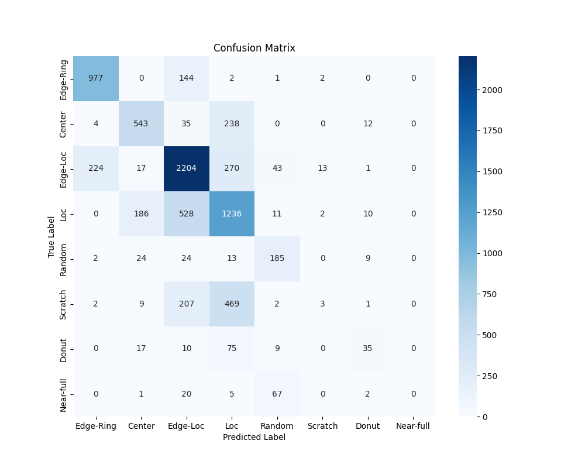
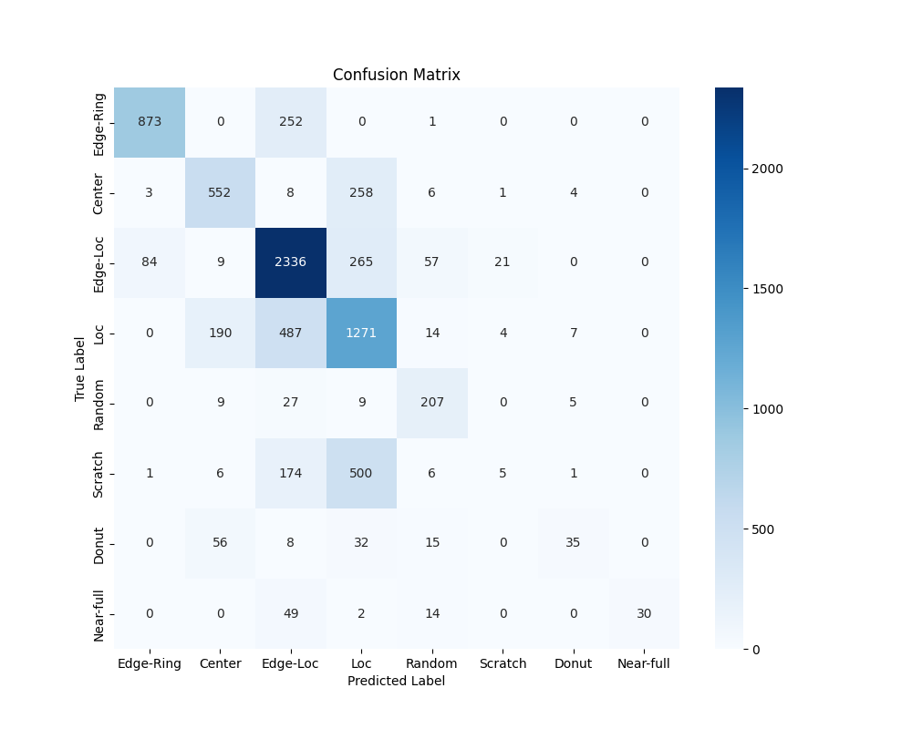
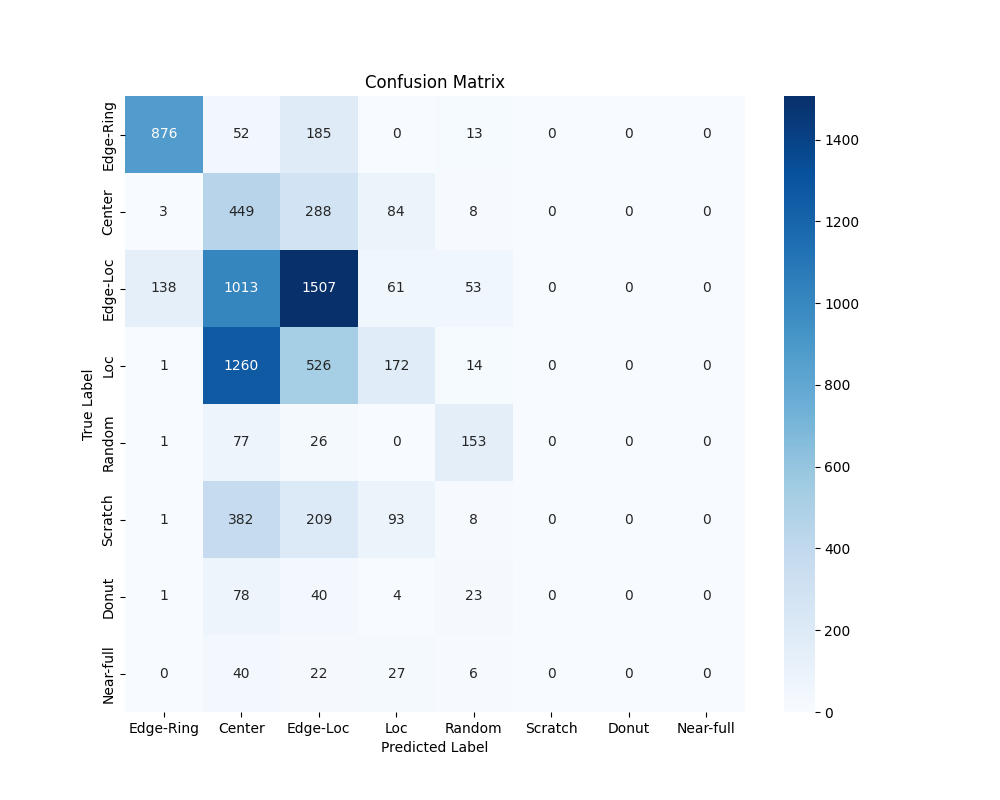

- [Model A2](#model-a2)
  - [Experiment 1](#experiment-1)
  - [Experiment 2](#experiment-2)
  - [Experiment 3](#experiment-3)
  - [Experiment 4](#experiment-4)
# Model A2

## Experiment 1
| Epoch | Loss   | Accuracy |
|-------|--------|----------|
| 1     | 1.1026 | 0.6121   |
| 2     | 0.8688 | 0.6729   |
| 3     | 0.7930 | 0.6971   |
| 4     | 0.7521 | 0.7118   |
| 5     | 0.6622 | 0.7473   |
| 6     | 0.5438 | 0.7896   |
| 7     | 0.4971 | 0.8097   |
| 8     | 0.4628 | 0.8232   |
| 9     | 0.4185 | 0.8428   |
| 10    | 0.3950 | 0.8522   |
| 11    | 0.3638 | 0.8637   |
| 12    | 0.3400 | 0.8714   |
| 13    | 0.3318 | 0.8765   |
| 14    | 0.3141 | 0.8810   |
| 15    | 0.3059 | 0.8841   |
| 16    | 0.2682 | 0.8962   |
| 17    | 0.2596 | 0.9013   |
| 18    | 0.2525 | 0.9026   |
| 19    | 0.2388 | 0.9079   |
| 20    | 0.2319 | 0.9113   |
| 21    | 0.2253 | 0.9138   |
| 22    | 0.2158 | 0.9182   |
| 23    | 0.2105 | 0.9191   |
| 24    | 0.2043 | 0.9201   |
| 25    | 0.2010 | 0.9228   |
| 26    | 0.2010 | 0.9211   |
| 27    | 0.1923 | 0.9239   |
| 28    | 0.1943 | 0.9232   |
| 29    | 0.1920 | 0.9244   |
| 30    | 0.1857 | 0.9259   |

**Per class accuracy report**
| Category    | Precision | Recall | F1-Score | Support |
|------------|-----------|--------|----------|---------|
| Edge-Ring  | 0.88      | 0.76   | 0.82     | 1126    |
| Center     | 0.75      | 0.60   | 0.67     | 832     |
| Edge-Loc   | 0.67      | 0.87   | 0.76     | 2772    |
| Loc        | 0.57      | 0.63   | 0.60     | 1973    |
| Random     | 0.65      | 0.71   | 0.68     | 257     |
| Scratch    | 0.26      | 0.03   | 0.05     | 693     |
| Donut      | 0.61      | 0.36   | 0.45     | 146     |
| Near-full  | 1.00      | 0.06   | 0.12     | 95      |
|             |            |        |          |         | 
| Accuracy  |         |        | 0.67     | 7894    |
| Macro Avg | 0.67    | 0.50   | 0.52     | 7894    |
| Weighted Avg | 0.65 | 0.67   | 0.64     | 7894    |

**Confusion Matrix**

## Experiment 2
| Epoch | Loss   | Accuracy |
|-------|--------|----------|
| 1     | 1.0955 | 0.6146   |
| 2     | 0.8601 | 0.6696   |
| 3     | 0.7478 | 0.7159   |
| 4     | 0.6994 | 0.7330   |
| 5     | 0.6177 | 0.7658   |
| 6     | 0.5446 | 0.7837   |
| 7     | 0.5198 | 0.7929   |
| 8     | 0.4933 | 0.8062   |
| 9     | 0.4604 | 0.8240   |
| 10    | 0.4310 | 0.8366   |
| 11    | 0.3891 | 0.8515   |
| 12    | 0.3793 | 0.8527   |
| 13    | 0.3574 | 0.8608   |
| 14    | 0.3344 | 0.8702   |
| 15    | 0.3207 | 0.8778   |
| 16    | 0.3044 | 0.8780   |
| 17    | 0.2891 | 0.8864   |
| 18    | 0.2903 | 0.8854   |
| 19    | 0.2742 | 0.8919   |
| 20    | 0.2686 | 0.8945   |
| 21    | 0.2523 | 0.9005   |
| 22    | 0.2453 | 0.9006   |
| 23    | 0.2448 | 0.9037   |
| 24    | 0.2359 | 0.9072   |
| 25    | 0.2309 | 0.9084   |
| 26    | 0.2192 | 0.9134   |
| 27    | 0.2173 | 0.9149   |
| 28    | 0.2185 | 0.9131   |
| 29    | 0.2143 | 0.9142   |
| 30    | 0.2120 | 0.9171   |

**Per class accuracy report**
| Category    | Precision | Recall | F1-Score | Support |
|------------|-----------|--------|----------|---------|
| Edge-Ring  | 0.81      | 0.87   | 0.84     | 1126    |
| Center     | 0.68      | 0.65   | 0.67     | 832     |
| Edge-Loc   | 0.69      | 0.80   | 0.74     | 2772    |
| Loc        | 0.54      | 0.63   | 0.58     | 1973    |
| Random     | 0.58      | 0.72   | 0.64     | 257     |
| Scratch    | 0.15      | 0.00   | 0.01     | 693     |
| Donut      | 0.50      | 0.24   | 0.32     | 146     |
| Near-full  | 1.00      | 0.00   | 0.00     | 95      |
|             |            |        |          |         | 
| Accuracy  |         |        | 0.66     | 7894    |
| Macro Avg | 0.62    | 0.49   | 0.47     | 7894    |
| Weighted Avg | 0.62 | 0.66   | 0.62     | 7894    |

**Confusion Matrix**

## Experiment 3
| Epoch | Loss   | Accuracy |
|-------|--------|----------|
| 1     | 1.2003 | 0.5951   |
| 2     | 0.9589 | 0.6518   |
| 3     | 0.8980 | 0.6626   |
| 4     | 0.8521 | 0.6792   |
| 5     | 0.8152 | 0.6906   |
| 6     | 0.7356 | 0.7184   |
| 7     | 0.6697 | 0.7538   |
| 8     | 0.6181 | 0.7758   |
| 9     | 0.5655 | 0.7968   |
| 10    | 0.5142 | 0.8183   |
| 11    | 0.4534 | 0.8378   |
| 12    | 0.4246 | 0.8462   |
| 13    | 0.4033 | 0.8528   |
| 14    | 0.3851 | 0.8627   |
| 15    | 0.3635 | 0.8695   |
| 16    | 0.3265 | 0.8824   |
| 17    | 0.3198 | 0.8844   |
| 18    | 0.3078 | 0.8882   |
| 19    | 0.2938 | 0.8916   |
| 20    | 0.2864 | 0.8958   |
| 21    | 0.2722 | 0.9010   |
| 22    | 0.2595 | 0.9029   |
| 23    | 0.2610 | 0.9045   |
| 24    | 0.2549 | 0.9082   |
| 25    | 0.2532 | 0.9098   |
| 26    | 0.2374 | 0.9129   |
| 27    | 0.2377 | 0.9150   |
| 28    | 0.2296 | 0.9178   |
| 29    | 0.2291 | 0.9177   |
| 30    | 0.2234 | 0.9185   |

**Per class accuracy report**
| Category    | Precision | Recall | F1-Score | Support |
|------------|-----------|--------|----------|---------|
| Edge-Ring  | 0.91      | 0.78   | 0.84     | 1126    |
| Center     | 0.67      | 0.66   | 0.67     | 832     |
| Edge-Loc   | 0.70      | 0.84   | 0.76     | 2772    |
| Loc        | 0.54      | 0.64   | 0.59     | 1973    |
| Random     | 0.65      | 0.81   | 0.72     | 257     |
| Scratch    | 0.16      | 0.01   | 0.01     | 693     |
| Donut      | 0.67      | 0.24   | 0.35     | 146     |
| Near-full  | 1.00      | 0.32   | 0.48     | 95      |
|            |           |        |          |         | 
| Accuracy  |         |        | 0.67     | 7894    |
| Macro Avg | 0.66    | 0.54   | 0.55     | 7894    |
| Weighted Avg | 0.64 | 0.67   | 0.64     | 7894    |

**Confusion Matrix**

## Experiment 4
| Epoch | Loss   | Accuracy |
|-------|--------|----------|
| 1     | 1.2459 | 0.5936   |
| 2     | 0.9541 | 0.6551   |
| 3     | 0.8962 | 0.6662   |
| 4     | 0.8454 | 0.6772   |
| 5     | 0.8207 | 0.6853   |
| 6     | 0.7577 | 0.7142   |
| 7     | 0.7330 | 0.7315   |
| 8     | 0.6639 | 0.7590   |
| 9     | 0.6371 | 0.7680   |
| 10    | 0.5988 | 0.7812   |
| 11    | 0.5512 | 0.8003   |
| 12    | 0.5124 | 0.8169   |
| 13    | 0.4863 | 0.8252   |
| 14    | 0.4540 | 0.8381   |
| 15    | 0.4228 | 0.8473   |
| 16    | 0.4010 | 0.8591   |
| 17    | 0.3845 | 0.8634   |
| 18    | 0.3647 | 0.8656   |
| 19    | 0.3578 | 0.8742   |
| 20    | 0.3456 | 0.8787   |
| 21    | 0.3313 | 0.8793   |
| 22    | 0.3258 | 0.8832   |
| 23    | 0.3169 | 0.8879   |
| 24    | 0.3138 | 0.8858   |
| 25    | 0.3080 | 0.8913   |
| 26    | 0.2964 | 0.8938   |
| 27    | 0.2951 | 0.8944   |
| 28    | 0.2895 | 0.8963   |
| 29    | 0.2849 | 0.8976   |
| 30    | 0.2875 | 0.8970   |
| 31    | 0.2774 | 0.8986   |
| 32    | 0.2780 | 0.9004   |
| 33    | 0.2725 | 0.9018   |
| 34    | 0.2714 | 0.9035   |
| 35    | 0.2756 | 0.9005   |
| 36    | 0.2707 | 0.9034   |
| 37    | 0.2684 | 0.9035   |
| 38    | 0.2712 | 0.9005   |
| 39    | 0.2616 | 0.9027   |
| 40    | 0.2691 | 0.9043   |

**Per class accuracy report**
| Category    | Precision | Recall | F1-Score | Support |
|------------|-----------|--------|----------|---------|
| Edge-Ring  | 0.90      | 0.78   | 0.83     | 1126    |
| Center     | 0.69      | 0.62   | 0.65     | 832     |
| Edge-Loc   | 0.70      | 0.86   | 0.77     | 2772    |
| Loc        | 0.53      | 0.64   | 0.58     | 1973    |
| Random     | 0.70      | 0.73   | 0.71     | 257     |
| Scratch    | 0.00      | 0.00   | 0.00     | 693     |
| Donut      | 0.58      | 0.32   | 0.41     | 146     |
| Near-full  | 1.00      | 0.00   | 0.00     | 95      |
|            |           |        |          |         | 
| Accuracy  |         |        | 0.67     | 7894    |
| Macro Avg | 0.64    | 0.49   | 0.50     | 7894    |
| Weighted Avg | 0.62 | 0.67   | 0.63     | 7894    |

**Confusion Matrix**

## Experiment 5
| Epoch | Loss   | Accuracy |
|-------|--------|----------|
| 1     | 1.4327 | 0.5254   |
| 2     | 1.1804 | 0.5716   |
| 3     | 1.1638 | 0.5772   |
| 4     | 1.1176 | 0.5845   |
| 5     | 1.1029 | 0.5903   |
| 6     | 1.0676 | 0.5991   |
| 7     | 1.0566 | 0.5982   |
| 8     | 1.0574 | 0.6040   |
| 9     | 1.0491 | 0.6035   |
| 10    | 1.0506 | 0.6068   |
| 11    | 1.0312 | 0.6117   |
| 12    | 1.0177 | 0.6197   |
| 13    | 1.0226 | 0.6144   |
| 14    | 1.0106 | 0.6169   |
| 15    | 1.0114 | 0.6173   |
| 16    | 1.0041 | 0.6208   |
| 17    | 0.9892 | 0.6239   |
| 18    | 0.9893 | 0.6272   |
| 19    | 0.9821 | 0.6328   |
| 20    | 0.9810 | 0.6301   |
| 21    | 0.9810 | 0.6306   |
| 22    | 0.9661 | 0.6333   |
| 23    | 0.9639 | 0.6351   |
| 24    | 0.9623 | 0.6344   |
| 25    | 0.9595 | 0.6349   |
| 26    | 0.9546 | 0.6407   |
| 27    | 0.9507 | 0.6431   |
| 28    | 0.9550 | 0.6387   |
| 29    | 0.9525 | 0.6431   |
| 30    | 0.9460 | 0.6385   |
| 31    | 0.9471 | 0.6395   |
| 32    | 0.9448 | 0.6455   |
| 33    | 0.9526 | 0.6422   |
| 34    | 0.9471 | 0.6391   |
| 35    | 0.9414 | 0.6418   |
| 36    | 0.9374 | 0.6458   |
| 37    | 0.9436 | 0.6390   |
| 38    | 0.9462 | 0.6432   |
| 39    | 0.9331 | 0.6479   |
| 40    | 0.9407 | 0.6439   |
| 41    | 0.9314 | 0.6487   |
| 42    | 0.9359 | 0.6487   |
| 43    | 0.9366 | 0.6427   |
| 44    | 0.9389 | 0.6449   |
| 45    | 0.9448 | 0.6399   |
| 46    | 0.9350 | 0.6450   |
| 47    | 0.9378 | 0.6454   |
| 48    | 0.9407 | 0.6458   |
| 49    | 0.9392 | 0.6451   |
| 50    | 0.9358 | 0.6452   |

**Per class accuracy report**
| Category    | Precision | Recall | F1-Score | Support |
|------------|-----------|--------|----------|---------|
| Edge-Ring  | 0.86      | 0.78   | 0.82     | 1126    |
| Center     | 0.13      | 0.54   | 0.21     | 832     |
| Edge-Loc   | 0.54      | 0.54   | 0.54     | 2772    |
| Loc        | 0.39      | 0.09   | 0.14     | 1973    |
| Random     | 0.55      | 0.60   | 0.57     | 257     |
| Scratch    | 0.00      | 0.00   | 0.00     | 693     |
| Donut      | 0.00      | 0.00   | 0.00     | 146     |
| Near-full  | 0.00      | 0.00   | 0.00     | 95      |
|            |           |        |          |         | 
| Accuracy  |         |        | 0.40     | 7894    |
| Macro Avg | 0.31    | 0.32   | 0.29     | 7894    |
| Weighted Avg | 0.44 | 0.40   | 0.38     | 7894    |

**Confusion Matrix**
